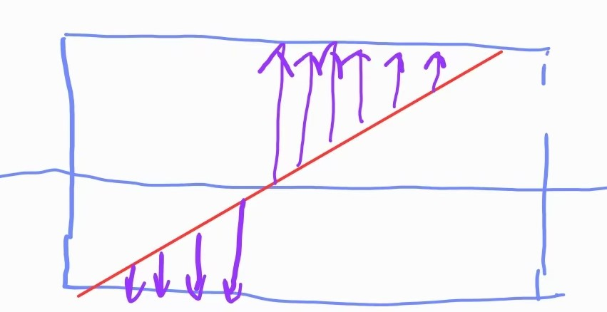

## 使用圆柱包络面

在计算相邻的铺层的连接路径的时候，增加一种投影到包络面的算法。其实这个想法很久之间便有了，当时只是实现了投影到原本的铺放表面，然后再沿着法向量进行偏移，但是法向对于一些稍微复杂一点的曲面，效果不好，投影的路径经常有一半在上面，一半突然到下面。这个原因是当要投影的直线穿过中心点附近时，到上下两面的距离几乎相等，所以投影后的点会跳跃，造成投影曲线不连续。实际上如果包络面是严格的圆柱面，这种情况很少会出现，因为被投影直线要正好穿过圆柱的中心线，这个在浮点数的世界是很难精确表达的。

<!-- more -->

那么使用圆柱作为包络面就几乎不会有什么问题，于是进行了以下测试，结果如下:

可以看到，效果基本上还可以，但是美中不足的是，连接路径似乎不是最短的路径，总觉得它在靠近两端的地方多了一些弯曲，导致整体的路径似乎不是最优的。

之前我已经实现 了在mesh上计算两点之间 的最短路径，如果把圆柱面转换为mesh，然后计算mesh上两点之间的最短路径，因该会得到更好的结果；这是可行的，但是没有必要，对于圆柱面来说，有更加简单高效的方法。

圆柱面的展开是一个矩形，计算圆柱面上两点之间的最短路径，可以转换到这个矩形上，很显然在矩形区域内任意两点间的最短路径就是连接两点的直线段；把这条直线段重新投影到圆柱面上就是三维圆柱面上两点的最短路径了。

图中稍微粗一点的是使用圆柱面上的最短路径算法，细一点的是使用圆柱面上的投影路径算法；显然，最短路径算法的曲率更小、距离更短，能够减少运行时间。

## 拓展到任意mesh曲面

上面是仅仅限于用圆柱面作为包络面，如果铺放的曲面和圆柱比较接近，那么没有问题 ；如果相差太大，使用圆柱面作为包络面，会导致连接路径太冗余了，还可能超过机器人的运动范围。因此，应该允许用户自己定义使用怎样的包络曲面，他可能会提前在CAD软件里面已经设计好包络面（安全退刀面）了。

在FiberArt里面，我们将用户自定义的包络面先转化为mesh，而mesh已经是实现了点的投影算法和计算两点之间最短路径的算法，所以用mesh还是用圆柱面来计算连接路径的过程是相同的。

## 自动计算最佳的包络面

上文提到，用户可以自己在CAD中设计包络面，那么有没有方法可以自动计算出一个还不错的包络面呢？

这里我想到的大概有以下几种：

### 自动计算包络圆柱面

包络圆柱面可以用铺放曲面的包围盒（bounding box）计算，把最长的轴 作为圆柱的中心线，然后计算外接圆柱；这种算法会比较高效，实现也简单，缺点就是冗余太多了，只有在铺放曲面是类圆柱的回转体时，才能算得上接近最优。

### 偏移凸包

可以先计算铺放曲面的凸包，然后沿着法向量偏移凸包的每个顶点，可以大致算出来一个比较紧凑的包络面。这个算法实现应该也不难，有很多开源库可以计算凸包，而且对凸包进行法向量偏移应该不会导致偏移后的mesh自相交。

### 拟合凸包为一些常见的形状

单纯使用凸包，可能导致包络面过于复杂，最终计算的路径不够平滑；如果事先定义一些常见的形状的，比如圆柱、圆锥、椭圆锥等，将凸包拟合成最相似的标准形状，这样不光会简化后续的路径计算，也会获得更加光滑的路径结果。

## 总结

以上是最近对FiberArt里面连接路径计算方法的一些改进，当然了，提到的某些想法还没有实现，自动计算凸包这个可能会是一个比较便捷的功能。