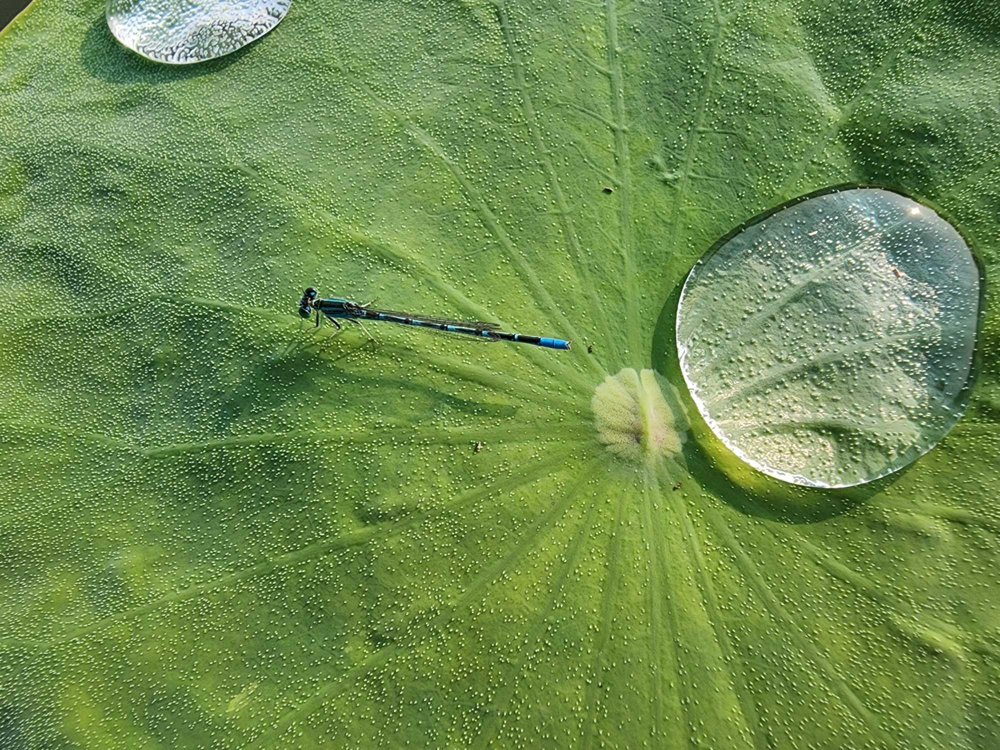
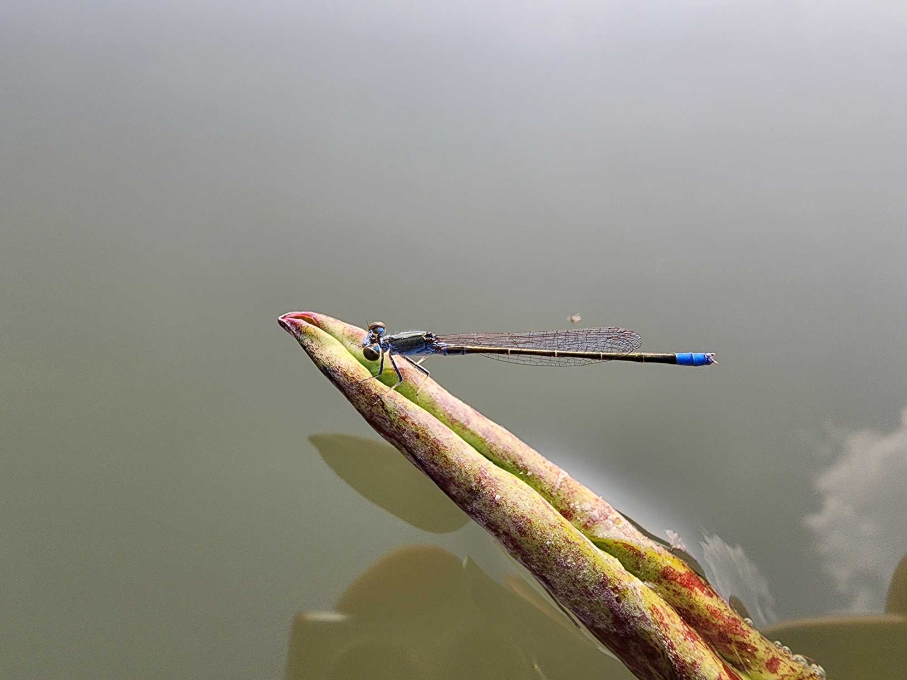

## 言论

- 中国企业习惯优先把好东西拿去出口，多余的以及稍微差一点的内销；这让我想起小时候长辈做生意，批发了一箱水果，总是优先把品质好的、大的挑出来卖给顾客，家人如果想吃就捡那些小的、快坏掉的。感觉在某些方面有一些相似，但又不尽相同。共同点是都包含了一些对更亲近的人的刻薄，对外人则是比较客气讨好。深层的原因则可能都是源于经济问题。日久成习以后，即便经济水平提高了，可能一时半会儿也改不过来了。

<!-- more -->

## 琐碎

今天又去了世博园，拍了很多荷花的美图。

*2025-06-21 21:30:10*