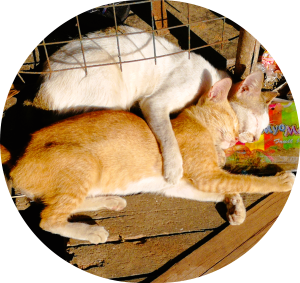

---
hide:
  - navigation
  - toc
  - footer
---

<h1 align="center">
Zen
</h1>

{ width="300px" data-title="路边两只互相依偎熟睡的橘猫" }
///caption
///

:racehorse: **出门搔白首，若负平生志** :crossed_swords:
{ .center }

[:fontawesome-solid-blog:](blog/index.md)
&nbsp;
[:simple-bilibili:](https://space.bilibili.com/231692492/dynamic?spm_id_from=333.1365.my-info.dyns.click)
&nbsp;
[:simple-github:](https://github.com/xiaodaxia-2008)
&nbsp;
[:simple-csdn:](https://blog.csdn.net/xiaozisheng2008_)
&nbsp;
[:simple-rss:](/feed_rss_created.xml)
&nbsp;
[🎇](./interesting/fireworks.html)
{ .center }

^^我所渴求的，无非是将心中脱颖欲出的本性付诸生活。为什么竟如此艰难呢？^^ (1)
{ .annotate .center }

1. 赫尔曼·黑塞，或曰：我所追求的，不过是将我心中呼之欲出的本性付诸实践而已
